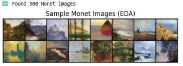

# GAN for Monet Style Image Generation

## 1. Problem & Data
- **Objective**: Train a GAN to generate Monet-style images based on the Monet dataset.  
- **Dataset**: Kaggle `monet_jpg` (total of 300 images).  

---

## 2. Exploratory Data Analysis (EDA)
Below are 16 sample images from the Monet dataset:

(Top-left image block)

---

## 3. Training Process
- **Model**: DCGAN (64×64 images, 100-dimensional latent vector).  
- **Optimizer**: Adam (lr=0.0002, betas=(0.5, 0.999))  
- **Loss Function**: Binary Cross Entropy Loss  

Training log sample:
Starting Training...
[0/1][0/19] Loss_D: 1.5044, Loss_G: 3.9782
Training Finished

---

## 4. Results

### 4.1 Generator & Discriminator Loss
The loss curves during training are shown below.  
The generator loss gradually increased, while the discriminator loss decreased over iterations.  

(Middle graph section)

---

### 4.2 Generated Monet-like Images
Here are 16 generated images after **1 training epoch**.  
At this stage, results are still noisy and lack clear structure—longer training is required.  

(Bottom image block)

---

## 5. Discussion & Conclusion
- **Achievement**: Successfully implemented a GAN pipeline to generate Monet-style images.  
- **Limitation**: With only 1 epoch, the generated images are noisy and do not yet resemble Monet’s style.  
- **Future Improvements**:  
  - Train for 50+ epochs for better quality  
  - Explore advanced architectures (StyleGAN, CycleGAN)  
  - Consider conditional GANs (cGANs) for style-specific control 
